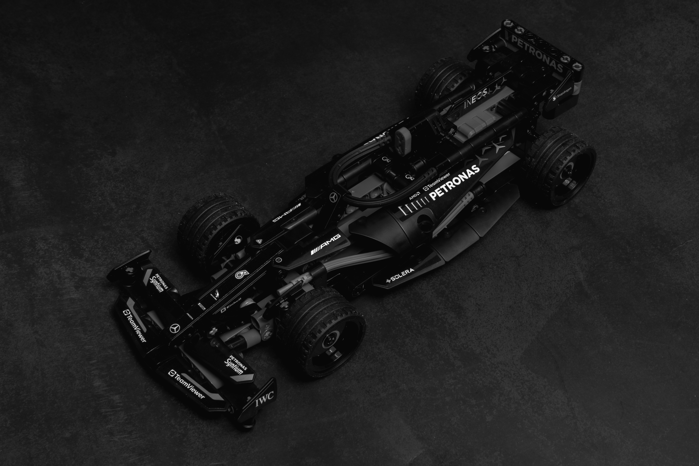

# 
 Welcome to Spaxe's profile! 

## About me 

Hello! I am Aadit, an first year BTech student who aspires to be a ML Engineer.  
I'm focused on learning, coding, and building meaningful projects; step by step, every single day.  
When I’m not coding, you’ll find me jamming to music or watching a F1 race. 
I have keen interest in cars, planes and anything that contains an engine for that matter.
  

## Stack & Tools

<table align="center">
  <tr>
    <td valign="top" width="10%">
      <h4>Stack</h4>
        
    </td>
    
  
  <td valign="top" width="10%">
      <h4>Tools</h4>
    
    </td>
  </tr>
</table>
